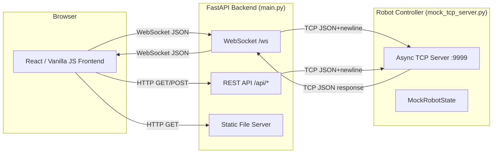
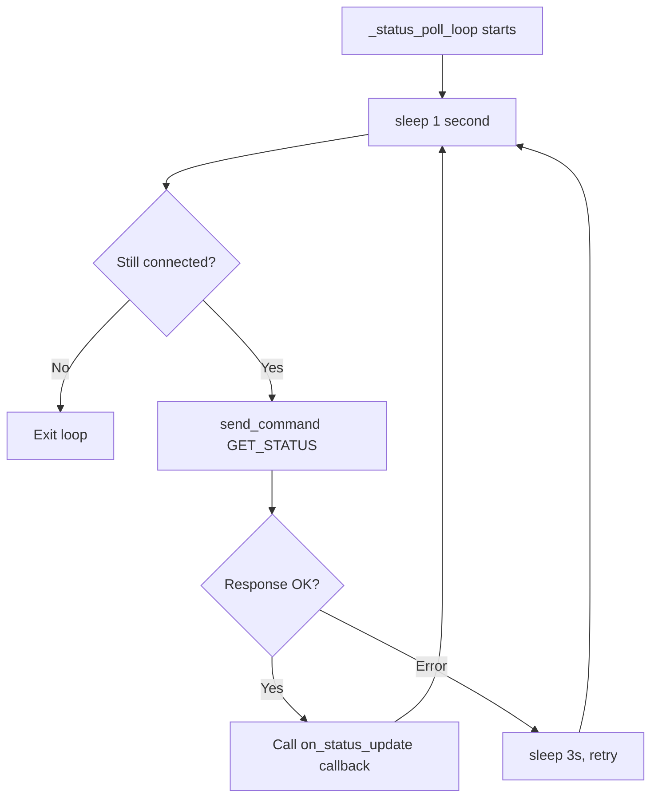
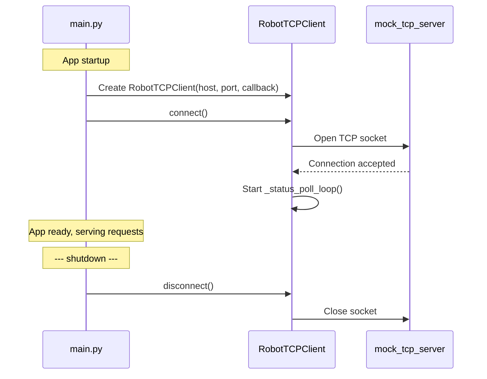
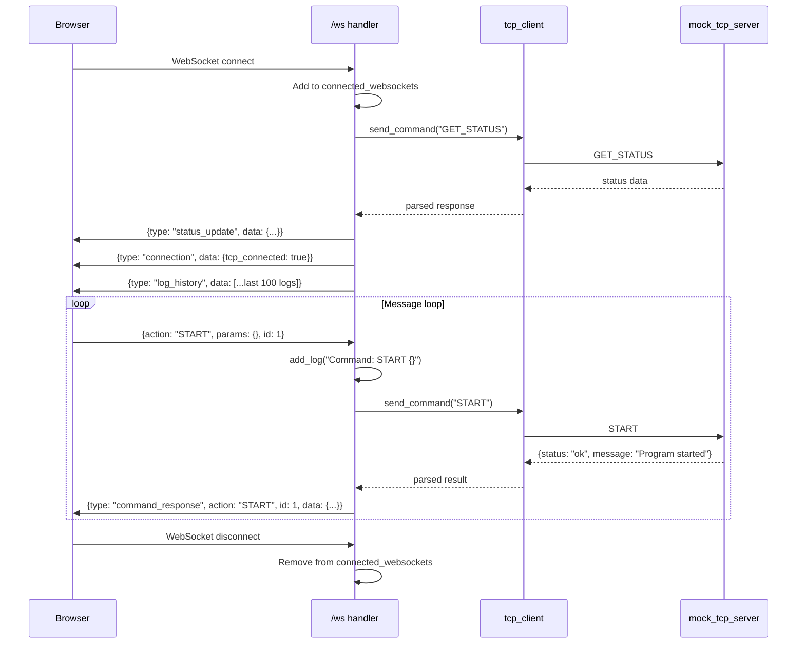
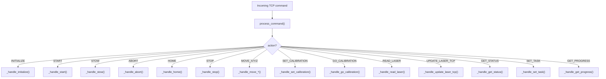
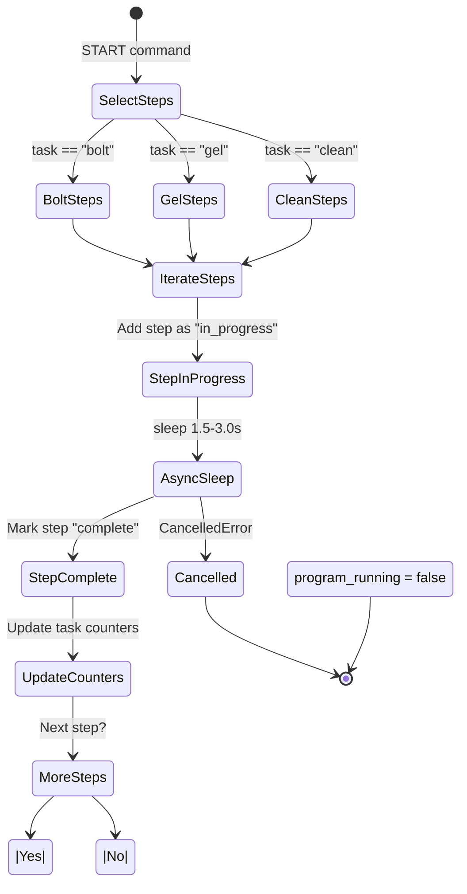
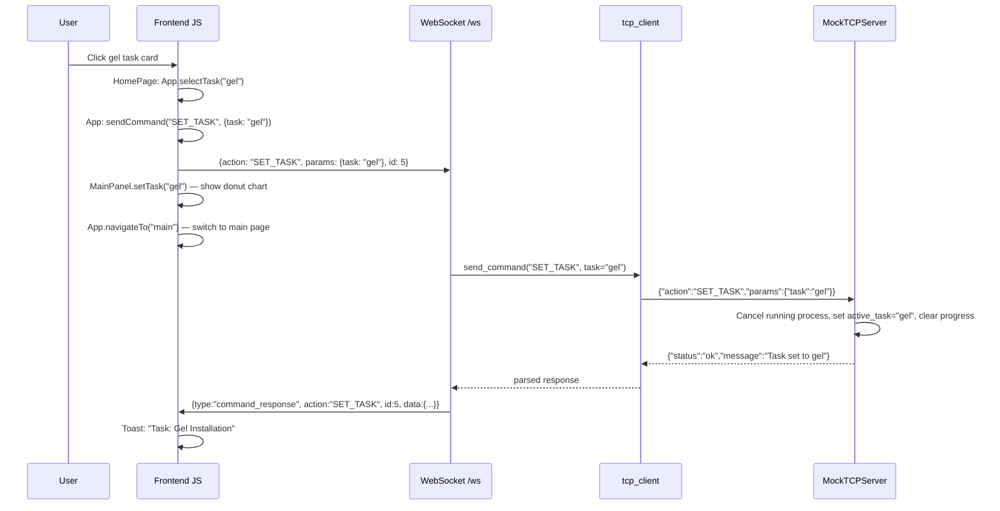
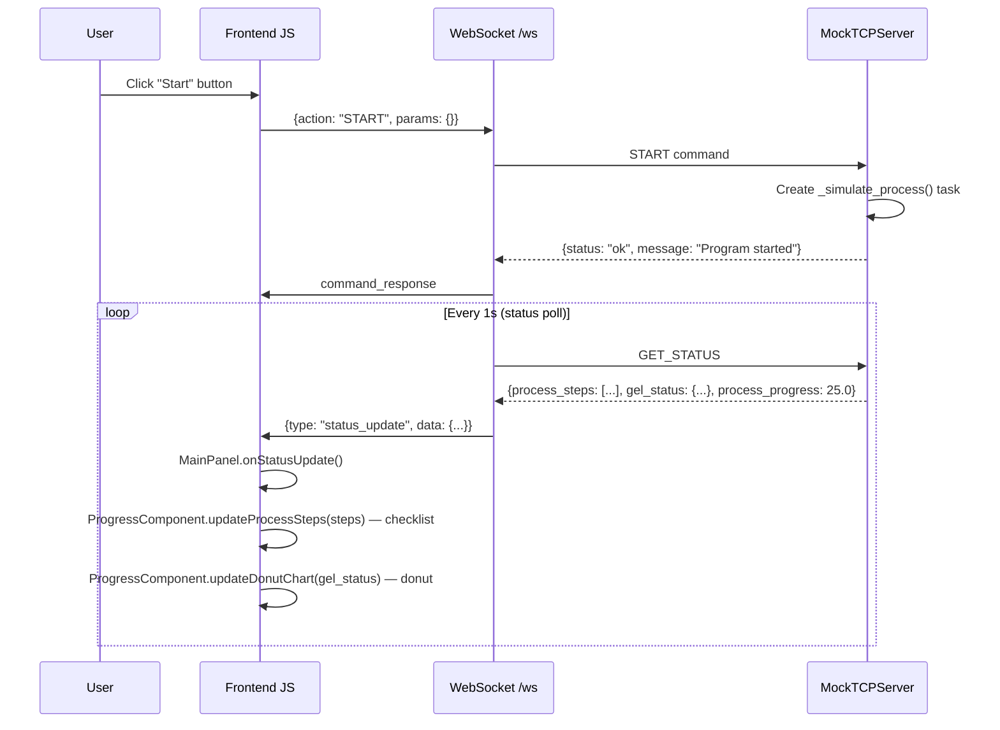
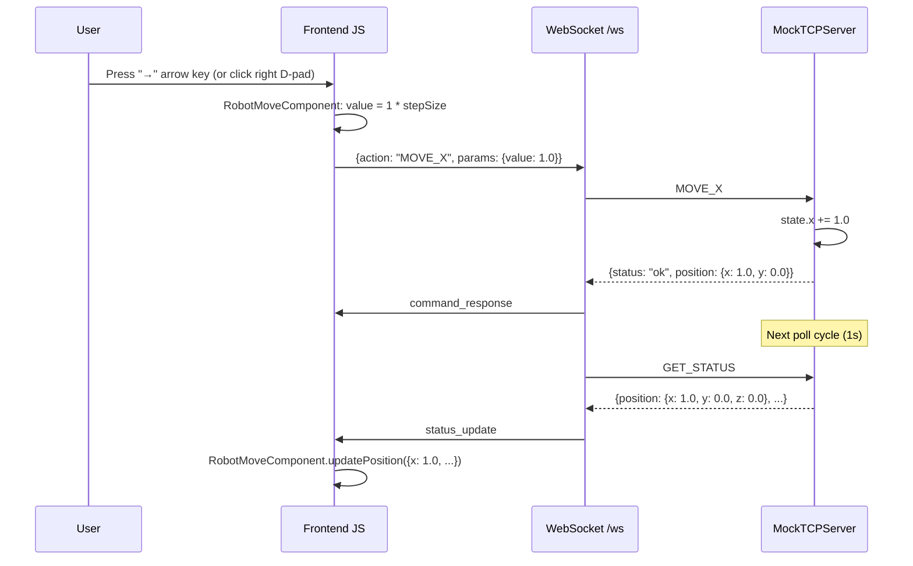
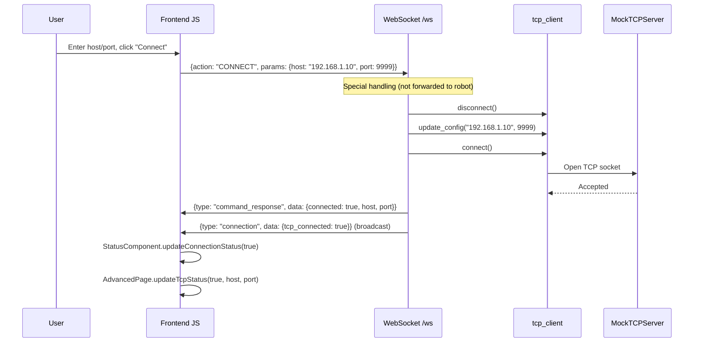

# MO Cobot Control — Backend Architecture

> A complete reference for every backend function, what it triggers, and how it communicates with the frontend.

---

## High-Level System Overview



---

## File Map

| File | Role |
|------|------|
| [main.py](file:///home/adi/Desktop/GUI/backend/main.py) | FastAPI app — WebSocket bridge, REST endpoints, static file server |
| [tcp_client.py](file:///home/adi/Desktop/GUI/backend/tcp_client.py) | Async TCP client — manages raw socket to robot, auto-reconnect, status polling |
| [command_protocol.py](file:///home/adi/Desktop/GUI/backend/command_protocol.py) | Protocol abstraction — builds/parses TCP payloads (single point of change) |
| [mock_tcp_server.py](file:///home/adi/Desktop/GUI/backend/mock_tcp_server.py) | Mock robot — simulates robot state, task processes, sensor data for development |

---

## 1. `command_protocol.py` — Protocol Layer

> [!NOTE]
> This file is the **single point of change** for the wire protocol. When connecting to a real robot, only `build_command()` and `parse_response()` need modification.

### Constants (Action Names)

| Constant | Value | Description |
|----------|-------|-------------|
| `INITIALIZE` | `"INITIALIZE"` | Power-on / initialize robot |
| `START` | `"START"` | Start current task program |
| `STOW` | `"STOW"` | Move to safe/stow position |
| `ABORT` | `"ABORT"` | Emergency abort |
| `HOME` | `"HOME"` | Home to origin |
| `STOP` | `"STOP"` | Stop current movement |
| `MOVE_X` / `MOVE_Y` / `MOVE_Z` | `"MOVE_X"` etc. | Jog along axis |
| `SET_CALIBRATION` | `"SET_CALIBRATION"` | Save current position as calibration point |
| `GO_CALIBRATION` | `"GO_CALIBRATION"` | Move to saved calibration point |
| `READ_LASER` | `"READ_LASER"` | Take laser measurement |
| `UPDATE_LASER_TCP` | `"UPDATE_LASER_TCP"` | Update laser TCP offset |
| `GET_STATUS` | `"GET_STATUS"` | Poll full robot status |
| `SET_TASK` | `"SET_TASK"` | Switch active task (bolt/gel/clean) |
| `GET_PROGRESS` | `"GET_PROGRESS"` | Get task progress and steps |

### Functions

#### [build_command](file:///home/adi/Desktop/GUI/backend/command_protocol.py#L41-L66)(action, **params) → bytes
Encodes a command into JSON + newline for TCP transmission.
```
{"action": "MOVE_X", "params": {"value": 1.5}} \n
```

#### [parse_response](file:///home/adi/Desktop/GUI/backend/command_protocol.py#L69-L93)(data: bytes) → dict
Decodes robot's TCP response from bytes to Python dict. Returns `{"status": "error", ...}` on parse failure.

---

## 2. `tcp_client.py` — RobotTCPClient

> [!IMPORTANT]
> The TCP client is instantiated once on startup in `main.py` and shared globally. It owns the socket connection and runs a background status polling loop.

### Class: [RobotTCPClient](file:///home/adi/Desktop/GUI/backend/tcp_client.py#L11-L170)

#### Constructor
```python
RobotTCPClient(host="127.0.0.1", port=9999, on_status_update=callback)
```
- `on_status_update`: async callback invoked every ~1s with the latest robot status dict

#### Properties

| Property | Returns | Description |
|----------|---------|-------------|
| `connected` | `bool` | Whether TCP socket is open |
| `config` | `dict` | `{host, port, connected}` |

#### Methods

| Method | What it does | Called by |
|--------|-------------|----------|
| [connect()](file:///home/adi/Desktop/GUI/backend/tcp_client.py#L41-L60) | Opens TCP socket, starts status poll loop | `lifespan()`, `send_command()`, WS handler |
| [disconnect()](file:///home/adi/Desktop/GUI/backend/tcp_client.py#L61-L79) | Cancels poll task, closes socket | `lifespan()`, WS handler (CONNECT/DISCONNECT) |
| [send_command(action, **params)](file:///home/adi/Desktop/GUI/backend/tcp_client.py#L80-L127) | Builds payload via `build_command()`, sends over TCP, reads response, parses via `parse_response()` | All command handlers in `main.py` |
| [update_config(host, port)](file:///home/adi/Desktop/GUI/backend/tcp_client.py#L36-L40) | Updates host/port (needs reconnect after) | WS handler (CONNECT), REST `/api/config` |
| [reconnect()](file:///home/adi/Desktop/GUI/backend/tcp_client.py#L154-L169) | Exponential backoff reconnect (up to 5 retries) | Not called currently (available for manual use) |

#### Background Task: [_status_poll_loop()](file:///home/adi/Desktop/GUI/backend/tcp_client.py#L139-L153)



This loop fires the `on_status_update` callback → which is wired to `on_robot_status_update()` in `main.py` → which broadcasts to all connected WebSocket clients.

---

## 3. `main.py` — FastAPI Application

### Startup/Shutdown: [lifespan()](file:///home/adi/Desktop/GUI/backend/main.py#L77-L103)



### Global State

| Variable | Type | Purpose |
|----------|------|---------|
| [tcp_client](file:///home/adi/Desktop/GUI/backend/main.py#L36) | `RobotTCPClient` | Single TCP connection instance |
| [connected_websockets](file:///home/adi/Desktop/GUI/backend/main.py#L37) | `set[WebSocket]` | All active browser WebSocket connections |
| [log_history](file:///home/adi/Desktop/GUI/backend/main.py#L38) | `list[dict]` | In-memory log buffer (max 500) |

### Helper Functions

| Function | What it does | Who calls it |
|----------|-------------|--------------|
| [add_log(level, message, source)](file:///home/adi/Desktop/GUI/backend/main.py#L42-L57) | Appends to `log_history`, broadcasts `{type: "log"}` to all WS clients | All handlers, lifespan |
| [broadcast(message)](file:///home/adi/Desktop/GUI/backend/main.py#L60-L68) | Sends JSON to every connected WebSocket, removes dead sockets | `add_log()`, `on_robot_status_update()`, WS handler |
| [on_robot_status_update(status)](file:///home/adi/Desktop/GUI/backend/main.py#L71-L73) | Broadcasts `{type: "status_update"}` — called by TCP client's poll loop | `tcp_client._status_poll_loop()` |

### REST Endpoints

| Endpoint | Method | Function | What it does | Frontend consumer |
|----------|--------|----------|-------------|-------------------|
| `/api/status` | GET | [get_status()](file:///home/adi/Desktop/GUI/backend/main.py#L118-L127) | Sends `GET_STATUS` to robot, returns full status + TCP config | Not used by current frontend (debug only) |
| `/api/config` | GET | [get_config()](file:///home/adi/Desktop/GUI/backend/main.py#L130-L135) | Returns `{host, port, connected}` | Not used by current frontend |
| `/api/config` | POST | [update_config(config)](file:///home/adi/Desktop/GUI/backend/main.py#L138-L158) | Disconnects, updates host/port, reconnects | Not used by current frontend |
| `/api/logs` | GET | [get_logs()](file:///home/adi/Desktop/GUI/backend/main.py#L161-L164) | Returns log history array | Not used by current frontend |
| `/api/commands` | GET | [get_commands()](file:///home/adi/Desktop/GUI/backend/main.py#L167-L170) | Returns `COMMAND_DESCRIPTIONS` dict | Not used by current frontend |
| `/` | GET | [serve_index()](file:///home/adi/Desktop/GUI/backend/main.py#L286-L289) | Serves `frontend/index.html` | Browser navigation |

> [!TIP]
> The REST endpoints exist but the frontend **primarily uses WebSocket** for all communication. REST is available for debugging/external tools.

### WebSocket Endpoint: [/ws](file:///home/adi/Desktop/GUI/backend/main.py#L174-L282)

This is the **core communication channel** between frontend and backend.

#### Connection Lifecycle



#### Special WebSocket Actions (handled in-line, not forwarded to robot)

| Action | What happens |
|--------|-------------|
| `CONNECT` | Disconnect current TCP, update config, reconnect, broadcast connection status |
| `DISCONNECT` | Disconnect TCP, broadcast `{tcp_connected: false}` |

#### Standard Actions (forwarded to robot)

All other actions (`INITIALIZE`, `START`, `STOW`, `ABORT`, `HOME`, `STOP`, `MOVE_X/Y/Z`, `SET_CALIBRATION`, `GO_CALIBRATION`, `READ_LASER`, `UPDATE_LASER_TCP`, `SET_TASK`, `GET_STATUS`, `GET_PROGRESS`) are forwarded via `tcp_client.send_command()` and the response is sent back as `{type: "command_response"}`.

### WebSocket Message Types (Backend → Frontend)

| `type` | `data` shape | When sent | Frontend handler |
|--------|-------------|-----------|-----------------|
| `status_update` | `{connected, robot_mode, current_command, program_running, safety_status, initialized, position, active_task, process_progress, process_steps, bolt_positions?, gel_status?}` | Every ~1s via poll loop + on WS connect | `App.onStatusUpdate()` → `MainPanel.onStatusUpdate()` |
| `connection` | `{tcp_connected: bool}` | On WS connect, CONNECT/DISCONNECT commands | `App.onConnectionUpdate()` → `StatusComponent`, `AdvancedPage` |
| `command_response` | `{action, id, data: {status, message, ...}}` | After every command | `App.onCommandResponse()` → `CalibratePage`, `AdvancedPage` |
| `log` | `{timestamp, level, message, source}` | On every `add_log()` call | `LogsPage.addEntry()` |
| `log_history` | `[...log entries]` | On WS connect (last 100) | `LogsPage.loadHistory()` |
| `error` | `{message}` | On invalid JSON from browser | `App.handleMessage()` → toast |

### WebSocket Message Types (Frontend → Backend)

| `action` | `params` | What triggers it in UI |
|----------|----------|----------------------|
| `INITIALIZE` | `{}` | Control panel "Initialize" button |
| `START` | `{}` | Control panel "Start" button |
| `STOW` | `{}` | Control panel "Stow" button |
| `ABORT` | `{}` | Control panel "Abort" button |
| `HOME` | `{}` | Control panel "Home" button |
| `STOP` | `{}` | Control panel "Stop" button |
| `MOVE_X` | `{value: float}` | Calibrate page D-pad or arrow keys |
| `MOVE_Y` | `{value: float}` | Calibrate page D-pad or arrow keys |
| `MOVE_Z` | `{value: float}` | Calibrate page D-pad buttons |
| `SET_CALIBRATION` | `{position: int}` | Calibrate page "Set" buttons |
| `GO_CALIBRATION` | `{position: int}` | Calibrate page "Go" buttons |
| `READ_LASER` | `{}` | Calibrate page "Read Laser" button |
| `UPDATE_LASER_TCP` | `{x, y, z}` | Calibrate page "Update TCP" button |
| `SET_TASK` | `{task: "bolt"\|"gel"\|"clean"}` | Home page task card click |
| `CONNECT` | `{host, port}` | Advanced page "Connect" button |
| `DISCONNECT` | `{}` | Advanced page "Disconnect" button |

---

## 4. `mock_tcp_server.py` — Robot Simulator

### Class: [MockRobotState](file:///home/adi/Desktop/GUI/backend/mock_tcp_server.py#L21-L100)

Holds all simulated robot state:

| State Field | Default | Updated by |
|-------------|---------|-----------|
| `robot_mode` | `"POWER_OFF"` | `INITIALIZE`, `STOW` |
| `current_command` | `"NO COMMAND"` | Every command handler |
| `program_running` | `false` | `START`, `ABORT`, process completion |
| `initialized` | `false` | `_simulate_init()` |
| `x, y, z` | `0.0` | `MOVE_X/Y/Z`, `HOME`, `STOW`, `GO_CALIBRATION` |
| `active_task` | `"bolt"` | `SET_TASK` |
| `process_steps` | `[]` | `_simulate_process()` |
| `process_progress` | `0.0` | `_simulate_process()` |
| `bolt_positions` | 40 entries (pending) | `_simulate_process()` (bolt task) |
| `outer_gels/inner_gels/backers` | `0` | `_simulate_process()` (gel task) |
| `cal_points` | `{1: {}, 2: {}}` | `SET_CALIBRATION` |
| `laser_value` | `0.0` | `READ_LASER` |

### Class: [MockTCPServer](file:///home/adi/Desktop/GUI/backend/mock_tcp_server.py#L103-L466)

#### Command Handler Dispatch

[process_command()](file:///home/adi/Desktop/GUI/backend/mock_tcp_server.py#L150-L178) routes to handlers:



#### Handler Details

| Handler | Immediate Return | Background Task | State Changes |
|---------|-----------------|-----------------|---------------|
| [_handle_initialize()](file:///home/adi/Desktop/GUI/backend/mock_tcp_server.py#L180-L187) | `{ok, "Initialization started"}` | [_simulate_init()](file:///home/adi/Desktop/GUI/backend/mock_tcp_server.py#L189-L194): 2s delay → `robot_mode="RUNNING"`, `initialized=true` | `robot_mode → INITIALIZING` |
| [_handle_start()](file:///home/adi/Desktop/GUI/backend/mock_tcp_server.py#L196-L209) | `{ok, "Program started"}` | [_simulate_process()](file:///home/adi/Desktop/GUI/backend/mock_tcp_server.py#L211-L286): multi-step simulation | `program_running → true`, `progress → 0` |
| [_handle_stow()](file:///home/adi/Desktop/GUI/backend/mock_tcp_server.py#L288-L301) | `{ok, "Stowing robot"}` | `_do_stow()`: 2s delay → xyz=0, mode=IDLE | `current_command → STOWING` |
| [_handle_abort()](file:///home/adi/Desktop/GUI/backend/mock_tcp_server.py#L303-L310) | `{ok, "Operation aborted"}` | Cancels `_process_task` | `program_running → false`, `progress → 0` |
| [_handle_home()](file:///home/adi/Desktop/GUI/backend/mock_tcp_server.py#L312-L324) | `{ok, "Homing robot"}` | `_do_home()`: 1.5s delay → xyz=0 | `current_command → HOMING` |
| [_handle_stop()](file:///home/adi/Desktop/GUI/backend/mock_tcp_server.py#L326-L328) | `{ok, "Movement stopped"}` | None | `current_command → STOPPED` |
| [_handle_move_x/y/z()](file:///home/adi/Desktop/GUI/backend/mock_tcp_server.py#L330-L376) | `{ok, position}` | `_clear()`: 0.5s delay → command="NO COMMAND" | `x/y/z += step` |
| [_handle_set_calibration()](file:///home/adi/Desktop/GUI/backend/mock_tcp_server.py#L378-L390) | `{ok, point data}` | None | Saves current xyz to `cal_points[position]` |
| [_handle_go_calibration()](file:///home/adi/Desktop/GUI/backend/mock_tcp_server.py#L392-L401) | `{ok}` or `{error}` | None | Moves xyz to saved calibration point |
| [_handle_read_laser()](file:///home/adi/Desktop/GUI/backend/mock_tcp_server.py#L403-L411) | `{ok, value, unit}` | None | Randomizes `laser_value` (0.1–50.0 mm) |
| [_handle_update_laser_tcp()](file:///home/adi/Desktop/GUI/backend/mock_tcp_server.py#L413-L419) | `{ok, tcp}` | None | Updates `laser_tcp` xyz |
| [_handle_get_status()](file:///home/adi/Desktop/GUI/backend/mock_tcp_server.py#L421-L422) | Full status dict | None | Read-only |
| [_handle_set_task()](file:///home/adi/Desktop/GUI/backend/mock_tcp_server.py#L424-L442) | `{ok, "Task set to X"}` | Cancels running process | Resets `active_task`, clears progress |
| [_handle_get_progress()](file:///home/adi/Desktop/GUI/backend/mock_tcp_server.py#L444-L450) | `{ok, progress, steps, task}` | None | Read-only |

#### Process Simulation: [_simulate_process()](file:///home/adi/Desktop/GUI/backend/mock_tcp_server.py#L211-L286)

This is the most complex function. It runs as a background `asyncio.Task` when `START` is received.



**Task-specific steps:**

| Task | Steps (8 each) | Counter updates |
|------|----------------|-----------------|
| **Bolt** | Moving to position → Aligning → Engaging → Applying torque → Verifying → Retracting → Moving to next → Complete | On "Verifying torque": marks next pending bolt as complete with random torque (20/40/60) |
| **Gel** | Pickup End Effector → Hover on ESC → Prep → Place → Press and hold → Validation → Return → Complete | On "Placement Validation": increments `outer_gels`, then `inner_gels`, then `backers` |
| **Clean** | Move to entry → Deploy tool → Zone 1 → Zone 2 → Zone 3 → Retract → Inspection → Complete | None |

---

## 5. Complete Data Flow Diagrams

### Flow 1: User Clicks "Gel Installation" Card on Home Page



### Flow 2: User Clicks "Start" During Gel Task



### Flow 3: Calibrate Page — D-pad Movement



### Flow 4: Advanced Page — TCP Reconnection



---

## 6. Frontend → Backend Function Mapping

### Which frontend module calls what backend function

| Frontend Module | User Action | Sends Action | Backend Handler | Robot Handler |
|----------------|-------------|-------------|-----------------|---------------|
| [HomePage](file:///home/adi/Desktop/GUI/frontend/js/pages/home.js) | Click task card | `SET_TASK` | WS → `tcp_client.send_command()` | `_handle_set_task()` |
| [MainPanel](file:///home/adi/Desktop/GUI/frontend/js/pages/main_panel.js) | Click INITIALIZE/START/STOW/ABORT/HOME/STOP | Respective action | WS → `tcp_client.send_command()` | Respective handler |
| [CalibratePage](file:///home/adi/Desktop/GUI/frontend/js/pages/calibrate.js) | Click Set/Go calibration | `SET_CALIBRATION` / `GO_CALIBRATION` | WS → `tcp_client.send_command()` | `_handle_set/go_calibration()` |
| [CalibratePage](file:///home/adi/Desktop/GUI/frontend/js/pages/calibrate.js) | Click Read Laser | `READ_LASER` | WS → `tcp_client.send_command()` | `_handle_read_laser()` |
| [CalibratePage](file:///home/adi/Desktop/GUI/frontend/js/pages/calibrate.js) | Click Update TCP | `UPDATE_LASER_TCP` | WS → `tcp_client.send_command()` | `_handle_update_laser_tcp()` |
| [RobotMoveComponent](file:///home/adi/Desktop/GUI/frontend/js/components/robot_move.js) | D-pad / arrow keys | `MOVE_X` / `MOVE_Y` | WS → `tcp_client.send_command()` | `_handle_move_x/y()` |
| [AdvancedPage](file:///home/adi/Desktop/GUI/frontend/js/pages/advanced.js) | Click Connect | `CONNECT` | WS handler (special) | N/A |
| [AdvancedPage](file:///home/adi/Desktop/GUI/frontend/js/pages/advanced.js) | Click Disconnect | `DISCONNECT` | WS handler (special) | N/A |
| [AdvancedPage](file:///home/adi/Desktop/GUI/frontend/js/pages/advanced.js) | Console Send | Any action | WS → `tcp_client.send_command()` | Respective handler |

### Which backend function updates which frontend module

| Backend Event | WS Message Type | Frontend Handler | UI Update |
|--------------|-----------------|-----------------|-----------|
| Status poll (every 1s) | `status_update` | `App.onStatusUpdate()` | `MainPanel` status indicators, `ProgressComponent` visuals, `RobotMoveComponent` position |
| TCP connect/disconnect | `connection` | `App.onConnectionUpdate()` | `StatusComponent` header dot, `AdvancedPage` TCP status |
| Any command response | `command_response` | `App.onCommandResponse()` | `CalibratePage` laser value, `AdvancedPage` console, toast |
| Server log created | `log` | `LogsPage.addEntry()` | Logs page real-time feed |
| WS first connect | `log_history` | `LogsPage.loadHistory()` | Logs page backfill |

---

## 7. Key Architecture Notes

> [!IMPORTANT]
> **Protocol swap point**: To connect to a real robot, only modify [build_command()](file:///home/adi/Desktop/GUI/backend/command_protocol.py#L41-L66) and [parse_response()](file:///home/adi/Desktop/GUI/backend/command_protocol.py#L69-L93). No other file changes needed.

> [!WARNING]
> The status poll loop runs every 1 second. Each poll triggers a full `GET_STATUS` → response → broadcast cycle. With many connected browsers, this creates significant traffic. Consider throttling or diff-based updates for production.

> [!NOTE]
> **`mock_tcp_server.py` uses background `asyncio.Task`s** for simulating delays (init: 2s, stow: 2s, home: 1.5s, process steps: 1.5-3s each). The `START` command's `_simulate_process()` can be cancelled by `ABORT` or `SET_TASK`.
