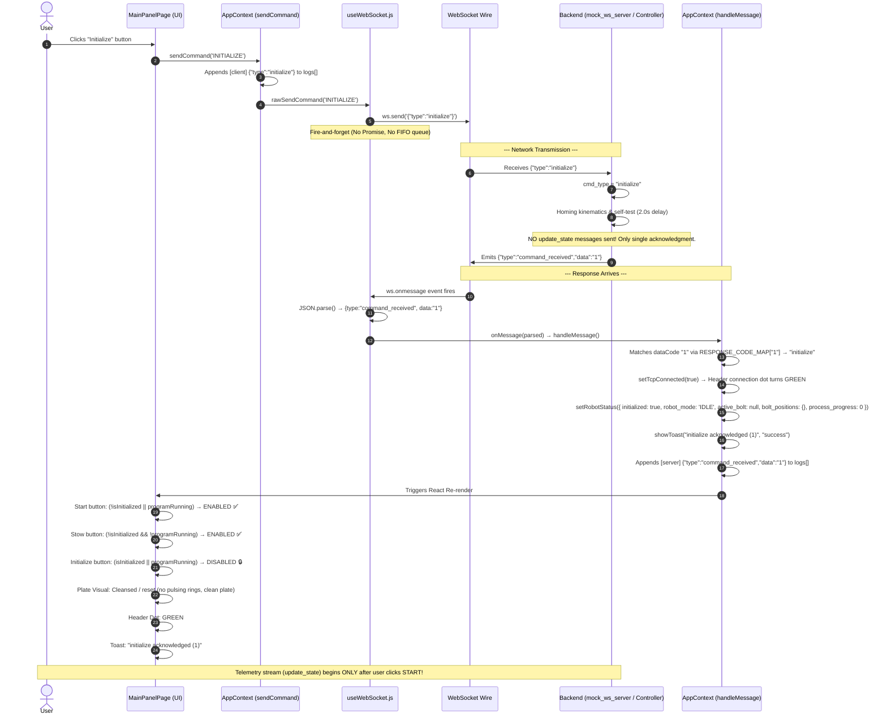

# Initialize & Control Flow Diagram (Current Architecture)

This document diagrams the complete lifecycle of the **Initialize**, **Start**, and **Stow** commands, button interlocks, network payloads, state mutations, and visual resets in the current architecture.

---

## 1. Sequence Diagram: Complete Initialize Flow



---

## 2. Button Interlock State Machine

The control buttons (`Initialize`, `Start`, `Stow`) transition strictly according to this truth table in [`MainPanelPage.jsx`](file:///home/adi/Desktop/GUIRev2/frontend-react/src/pages/MainPanelPage.jsx#L14-L35):

```text
┌──────────────────────────────────────────────────────────────────────────────────┐
│                             BUTTON LIFECYCLE STATES                              │
│                                                                                  │
│   [1. STARTUP / STOWED]                                                         │
│   • Initialize: ENABLED                                                          │
│   • Start:      DISABLED (not initialized)                                       │
│   • Stow:       DISABLED (already parked)                                        │
│           │                                                                      │
│           │ User clicks Initialize (Ack "1")                                     │
│           ▼                                                                      │
│   [2. INITIALIZED / IDLE]                                                        │
│   • Initialize: DISABLED (already initialized)                                   │
│   • Start:      ENABLED  (ready to execute)                                      │
│   • Stow:       ENABLED  (can park back)                                         │
│           │                                                                      │
│           │ User clicks Start (Ack "2")                                          │
│           ▼                                                                      │
│   [3. RUNNING / BOLTING]                                                         │
│   • Initialize: DISABLED (cannot init while moving)                              │
│   • Start:      DISABLED (already running)                                       │
│   • Stow:       ENABLED  (can park/halt process at any time)                     │
│           │                                                                      │
│           │ User clicks Stow (Ack "4")                                           │
│           ▼                                                                      │
│   [4. HALTED & STOWED] (Returns to State 1)                                      │
│   • Initialize: ENABLED                                                          │
│   • Start:      DISABLED                                                         │
│   • Stow:       DISABLED                                                         │
│   • Plate:      Visuals completely wiped clean                                   │
└──────────────────────────────────────────────────────────────────────────────────┘
```

---

## 3. Step-by-Step Code Walkthrough

### Step 1: User Clicks "Initialize"

**File:** [`MainPanelPage.jsx`](file:///home/adi/Desktop/GUIRev2/frontend-react/src/pages/MainPanelPage.jsx)

```jsx
const isInitialized = !robotStatus.initialized;
const programRunning = !robotStatus.program_running;
const initializing = robotStatus.robot_mode === 'INITIALIZING';

// 1. Initialize is enabled only when NOT initialized and NOT running
const isInitializeDisabled = isInitialized || initializing || programRunning;

// 2. Start is enabled only when initialized and NOT running
const isStartDisabled = !isInitialized || programRunning;

// 3. Stow is enabled when initialized OR running (can stow from idle or running)
const isStowDisabled = !isInitialized && !programRunning;

const CONTROLS = [
    { action: 'INITIALIZE', label: 'Initialize', disabled: isInitializeDisabled },
    { action: 'START', label: 'Start', disabled: isStartDisabled },
    { action: 'STOW', label: 'Stow', disabled: isStowDisabled },
];

// Click dispatches action directly:
<button disabled={btn.disabled} onClick={() => sendCommand(btn.action)}>
    {btn.label}
</button>
```

---

### Step 2: AppContext.sendCommand() — Outbound Logging & Dispatch

**File:** [`AppContext.jsx`](file:///home/adi/Desktop/GUIRev2/frontend-react/src/context/AppContext.jsx#L161-L181)

```jsx
const sendCommand = useCallback((action, params = {}) => {
    // 1. Format payload: { "type": "initialize" }
    const msg = { type: action.toLowerCase() };
    if (Object.keys(params).length) {
        msg.data = params;
    }
    const rawSent = JSON.stringify(msg);

    // 2. Append to in-memory audit log
    setLogs((prev) => {
        const next = [...prev, {
            timestamp: Date.now() / 1000,
            level: 'INFO',
            source: 'client',
            message: rawSent,
        }];
        return next.length > 1000 ? next.slice(next.length - 1000) : next;
    });

    // 3. Low-level wire send (no FIFO, no Promise)
    rawSendCommand(action, params);
}, [rawSendCommand]);
```

---

### Step 3: useWebSocket.js — Direct Wire Send

**File:** [`useWebSocket.js`](file:///home/adi/Desktop/GUIRev2/frontend-react/src/hooks/useWebSocket.js#L92-L104)

```jsx
const sendCommand = useCallback((action, params = {}) => {
    const ws = wsRef.current;
    if (!ws || ws.readyState !== WebSocket.OPEN) {
        console.warn('[WS] Not connected, cannot send:', action);
        return;
    }

    const msg = { type: action.toLowerCase() };
    if (Object.keys(params).length) {
        msg.data = params;
    }
    ws.send(JSON.stringify(msg)); // Transmitted over WebSocket
}, []);
```

**Over the wire:**
```json
{"type": "initialize"}
```

---

### Step 4: Backend Execution & Single Response

**File:** [`backend/mock_ws_server.py`](file:///home/adi/Desktop/GUIRev2/backend/mock_ws_server.py)

```python
elif cmd_type == "initialize":
    self.robot.robot_mode = "INITIALIZING"
    self.robot.current_command = "INITIALIZING"
    # Delay: 2.0 seconds
    # Response code: "1"
```

The server finishes initialization and emits **only one frame**:
```json
{"type": "command_received", "data": "1"}
```

> [!NOTE]
> The backend does **not** stream `update_state` during initialization.

---

### Step 5: Inbound Dispatch & State Mutation

**File:** [`AppContext.jsx`](file:///home/adi/Desktop/GUIRev2/frontend-react/src/context/AppContext.jsx#L68-L115)

```jsx
case 'command_received': {
    // 5a. Extract dataCode ("1")
    let rawCode = message.data;
    const dataCode = String(rawCode ?? '').trim();

    // 5b. Match via lookup table
    const commandName = RESPONSE_CODE_MAP[dataCode]; // "1" -> "initialize"

    // 5c. Set TCP connected (Green dot)
    setTcpConnected(true);

    // 5d. Mutate robot state and reset visual buffers
    switch (commandName) {
        case 'initialize':
            setRobotStatus(prev => ({
                ...prev,
                initialized: true,         // ← UNLOCKS START BUTTON
                robot_mode: 'IDLE',
                program_running: false,
                active_bolt: null,         // ← CLEARS VISUAL ACTIVE BOLT
                process_progress: 0,       // ← RESETS PROGRESS
                bolt_positions: {},        // ← CLEANS BOLTING PLATE
            }));
            break;
        // ...
    }

    // 5e. Toast notification & console logging
    showToast(`${commandName} acknowledged (${dataCode})`, 'success');
    break;
}
```

---

### Step 6: UI Re-render & Visualizer Behavior

1. **Button States Update:**
   * **`Start`**: `!isInitialized` becomes `false` ➔ **ENABLED**.
   * **`Stow`**: `!isInitialized && !programRunning` becomes `false` ➔ **ENABLED**.
   * **`Initialize`**: `isInitialized` becomes `true` ➔ **DISABLED**.
2. **Plate Visualizer ([`BoltPlateVisual.jsx`](file:///home/adi/Desktop/GUIRev2/frontend-react/src/components/BoltPlateVisual.jsx)):**
   * Active bolt pulsing is strictly gated:
     ```javascript
     const reported = (bolting && activeBolt !== null) ? String(activeBolt) : null;
     ```
   * Because `bolting` (`programRunning`) is `false`, **no halo rings pulse**. The plate remains clean and ready for execution.
3. **Header Indicator ([`Header.jsx`](file:///home/adi/Desktop/GUIRev2/frontend-react/src/components/Header.jsx)):**
   * `tcpConnected === true` ➔ Green status dot.
4. **Logs Tab ([`LogsPage.jsx`](file:///home/adi/Desktop/GUIRev2/frontend-react/src/pages/LogsPage.jsx)):**
   * Displays the paired entries:
     ```text
     [client]  {"type":"initialize"}
     [server]  {"type":"command_received","data":"1"}
     ```

---

## 4. What Happens Next: Transition to Start & Bolting

When the operator clicks **Start**:

```
Browser  ──────────────────────────►  Backend
         {"type":"start"}

Backend  ──────────────────────────►  Browser
         {"type":"command_received","data":"2"}

Backend  ══════════════════════════►  Browser (Telemetry Stream Active)
         {"type":"update_state","data":{"program_running":true,"active_bolt":1,...}}
         {"type":"update_state","data":{"program_running":true,"active_bolt":2,...}}
         ...
```

* Response code `"2"` arrives.
* `program_running` flips to `true`.
* **`Start`** disables, **`Initialize`** stays disabled, **`Stow` stays ENABLED**.
* Bolt 1 begins pulsing with the yellow ring on the plate visualizer.
* Telemetry streams continuously until all bolts complete or until the operator clicks **Stow**.
