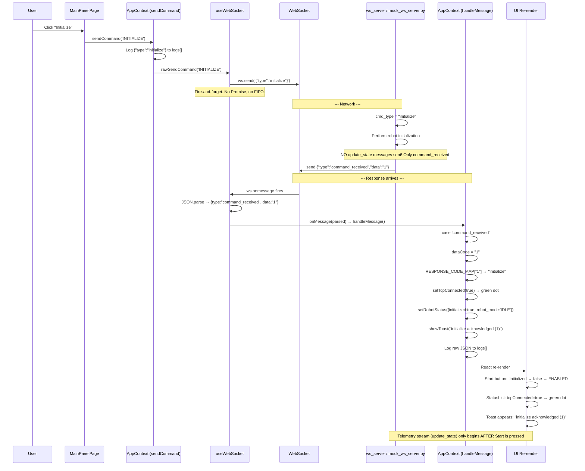

# Initialize Button — Complete End-to-End Flow (Updated Protocol)

## Sequence Diagram



---

## Step-by-Step Code Walkthrough

---

### Step 1: User Clicks "Initialize" Button

**File:** [`MainPanelPage.jsx`](file:///home/adi/Desktop/GUIRev2/frontend-react/src/pages/MainPanelPage.jsx#L18-L35)

```jsx
// Line 18-22: Button definitions
const CONTROLS = [
    { action: 'INITIALIZE', label: 'Initialize', disabled: initializing },
    { action: 'START', label: 'Start', disabled: !robotStatus.initialized || programRunning },
    { action: 'STOW', label: 'Stow', disabled: programRunning },
];

// Line 29-35: Button rendering — ALL buttons use sendCommand() directly
{CONTROLS.map((btn) => (
    <button
        key={btn.action}
        className="hmi-btn ctrl-btn"
        disabled={btn.disabled}
        onClick={() => sendCommand(btn.action)}   // ← sendCommand('INITIALIZE')
    >
        {btn.label}
    </button>
))}
```

**What happens:** `sendCommand('INITIALIZE')` is called from `AppContext`.

---

### Step 2: AppContext.sendCommand() — Log + Forward

**File:** [`AppContext.jsx`](file:///home/adi/Desktop/GUIRev2/frontend-react/src/context/AppContext.jsx#L161-L181)

```jsx
// Line 161-181
const sendCommand = useCallback((action, params = {}) => {
    // 1. Build the message object
    const msg = { type: action.toLowerCase() };  // → { type: "initialize" }
    if (Object.keys(params).length) {
        msg.data = params;                        // No params for Initialize, so skipped
    }
    const rawSent = JSON.stringify(msg);           // → '{"type":"initialize"}'
    console.log('[WS-SEND]', rawSent);

    // 2. Log exact raw sent JSON to the Logs tab
    setLogs((prev) => {
        const next = [...prev, {
            timestamp: Date.now() / 1000,
            level: 'INFO',
            source: 'client',                      // ← Marks it as sent FROM the HMI
            message: rawSent,                      // ← '{"type":"initialize"}'
        }];
        return next.length > 1000 ? next.slice(next.length - 1000) : next;
    });

    // 3. Fire-and-forget — no Promise, no pendingCommandsRef
    rawSendCommand(action, params);
}, [rawSendCommand]);
```

---

### Step 3: useWebSocket.sendCommand() — Wire Send

**File:** [`useWebSocket.js`](file:///home/adi/Desktop/GUIRev2/frontend-react/src/hooks/useWebSocket.js#L92-L104)

```jsx
// Line 92-104
const sendCommand = useCallback((action, params = {}) => {
    const ws = wsRef.current;
    if (!ws || ws.readyState !== WebSocket.OPEN) {
        console.warn('[WS] Not connected, cannot send:', action);
        return;
    }

    const msg = { type: action.toLowerCase() };    // → { type: "initialize" }
    if (Object.keys(params).length) {
        msg.data = params;
    }
    ws.send(JSON.stringify(msg));                   // ← Sent over wire. No Promise.
}, []);
```

**What's on the wire:**
```
Browser  ──────────────────────────►  Backend
         {"type":"initialize"}
```

---

### Step 4: Backend Execution & Response

The real robot backend executes initialization and responds with **only one message**:

```
Backend  ──────────────────────────►  Browser
{"type":"command_received","data":"1"}
```

> [!IMPORTANT]
> **No `update_state` messages are sent during initialization.** The real backend only emits `command_received` with code `"1"`. The telemetry stream (`update_state`) only starts once the user presses **Start** and the robot begins active execution.

---

### Step 5: useWebSocket.onmessage — Direct Dispatch

**File:** [`useWebSocket.js`](file:///home/adi/Desktop/GUIRev2/frontend-react/src/hooks/useWebSocket.js#L44-L52)

```jsx
// Line 44-52: ws.onmessage handler
ws.onmessage = (event) => {
    try {
        const message = JSON.parse(event.data);
        // message = {"type":"command_received","data":"1"}

        // Dispatch directly to AppContext.handleMessage
        onMessageRef.current?.(message);
    } catch (e) {
        console.error('[WS] Failed to parse message:', e);
    }
};
```

---

### Step 6: AppContext.handleMessage — Response Code Matching & State Update

**File:** [`AppContext.jsx`](file:///home/adi/Desktop/GUIRev2/frontend-react/src/context/AppContext.jsx#L8-L20, #L62-L115)

```jsx
// Response mapping lookup
const RESPONSE_CODE_MAP = {
    '0': 'release_brakes',
    '1': 'initialize',        // ← data:"1" maps here
    '2': 'start',
    '3': 'pause',
    '4': 'stow',
    '5': 'turn_robot_off',
    '6': 'turn_robot_on',
};

// Inside handleMessage:
case 'command_received': {
    // 6a. Match command by string data code
    const dataCode = String(message.data ?? '');
    const commandName = RESPONSE_CODE_MAP[dataCode] || `unknown(${dataCode})`;
    // commandName = "initialize"

    // 6b. Any successful command acknowledgment confirms connection
    setTcpConnected(true);                                // ← GREEN DOT

    // 6c. Output to console and show toast
    addConsoleLine(`← command_received [${commandName}] data: ${dataCode}`, 'received');
    showToast(`${commandName} acknowledged (${dataCode})`, 'success');

    // 6d. Update robotStatus — this enables the Start button!
    switch (commandName) {
        case 'initialize':
            setRobotStatus(prev => ({
                ...prev,
                initialized: true,                        // ← ENABLES START BUTTON
                robot_mode: 'IDLE'
            }));
            break;
        // ...
    }

    // 6e. Log raw JSON to Logs tab
    setLogs((prev) => [...prev, {
        timestamp: Date.now() / 1000,
        level: 'INFO',
        source: 'server',
        message: JSON.stringify(message),
    }]);
    break;
}
```

---

### Step 7: React Re-render — UI State Updates

1. **Start Button Enables**:
   ```jsx
   // MainPanelPage.jsx line 20:
   { action: 'START', label: 'Start', disabled: !robotStatus.initialized || programRunning }
   // !robotStatus.initialized is now false -> disabled = false ✅
   ```
2. **Connection Dot**:
   ```jsx
   // StatusList.jsx:
   <span className={`status-dot ${connected ? 'green' : 'red'}`}></span>
   // tcpConnected = true -> green dot ✅
   ```
3. **Toast**: Pop-up appears: `"initialize acknowledged (1)"` (auto-dismissed in 4s).
4. **Logs Tab**: Shows two rows:
   ```
   [client]  {"type":"initialize"}
   [server]  {"type":"command_received","data":"1"}
   ```

---

### When Does `update_state` Arrive?

Telemetry stream (`update_state`) begins **only after `start` is executed**:

```
Browser  ──────────────────────────►  Backend
         {"type":"start"}

Backend  ──────────────────────────►  Browser
         {"type":"command_received","data":"2"}

Backend  ══════════════════════════►  Browser (Continuous Telemetry Stream)
         {"type":"update_state","data":{"program_running":true,"active_bolt":1,...}}
         {"type":"update_state","data":{"program_running":true,"active_bolt":2,...}}
         ...
```
